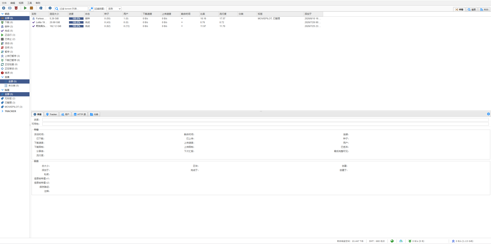
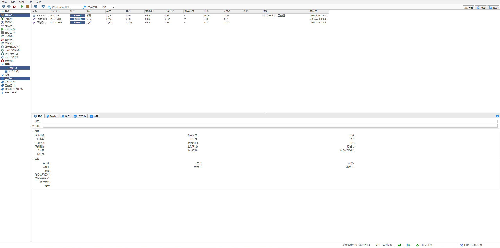

# qBittorrent Classic WebUI

[English](README_EN.md)

## 前言

一直不喜欢新版 qBittorrent WebUI 的颜色：太亮、太艳，长时间看有点晃眼。

更喜欢以前偏灰度、低饱和的界面，也怀念旧版那种简单、紧凑的感觉，所以做了这个工作流。

这个项目**不重写 qBittorrent WebUI**：功能、WebAPI 和页面逻辑全部来自对应版本的 qBittorrent 官方 WebUI，只额外覆盖 Classic CSS 视觉样式。

qBittorrent **5.2.0 起**，官方 WebUI 加入了提高显示密度（Display density）的选项。Classic WebUI 保留这一官方行为：默认仍是默认密度，需要更高信息密度时再切换到紧凑模式。

GitHub Actions 会跟随 qBittorrent 官方稳定版自动构建 Release。

## 预览

### 默认



### 紧凑（qBittorrent 5.2.0+）



## 安装

1. 在 **Releases** 下载：

```text
classic-webui.zip
```

2. 找到宿主机中已经映射到容器 `/config` 的目录，把压缩包解压为：

```text
classic-webui/
├── public/
├── private/
├── translations/
└── COPYING
```

例如 Docker 中已有：

```yaml
volumes:
  - ./config:/config
```

那么宿主机最终目录应为：

```text
./config/classic-webui
```

不需要增加额外的 WebUI volume 映射。

命令行解压可直接使用：

```bash
unzip classic-webui.zip -d ./classic-webui
```

3. 打开 qBittorrent：

```text
工具 → 选项 → Web UI
```

启用 **使用备选 WebUI**，文件位置填写：

```text
/config/classic-webui
```

4. 保存设置并刷新浏览器。

## 更新

下载新的 Release，用新的 `classic-webui` 目录替换旧目录即可。

qBittorrent 中的路径始终保持：

```text
/config/classic-webui
```

## 说明

- 官方功能、WebAPI、HTML / JavaScript：来自对应版本 qBittorrent。
- Classic：仅修改视觉 CSS。
- qBittorrent 5.2.0+ 支持官方显示密度设置，默认和紧凑模式均保留。
- Release 内附 `COPYING`。
